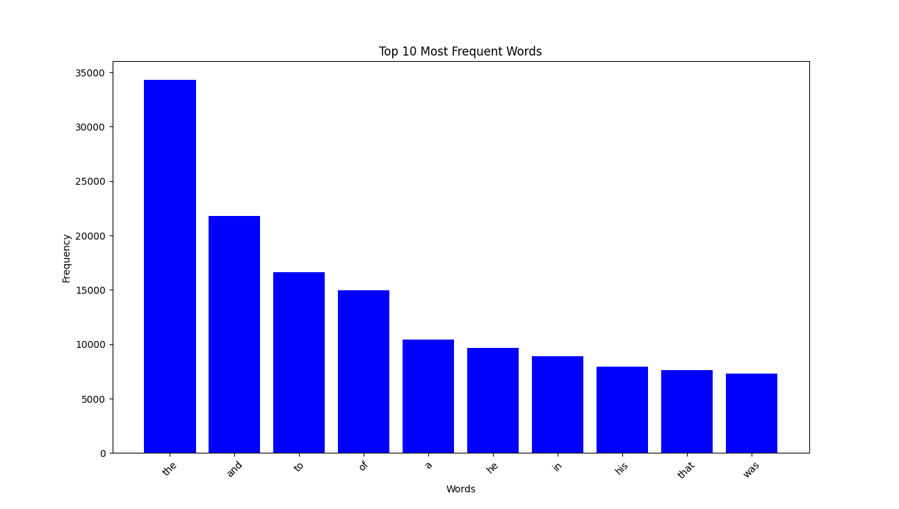

# goit-algo2-hw-06

# Завдання

Напишіть Python-скрипт, який завантажує текст із заданої URL-адреси, аналізує частоту використання слів у тексті за допомогою парадигми MapReduce і візуалізує топ-слова з найвищою частотою використання у тексті.

## Покрокова інструкція:

1. Імпортуйте необхідні модулі (matplotlib та інші).
2. Візьміть код реалізації MapReduce з конспекту.
3. Створіть функцію visualize_top_words для візуалізації результатів.
4. У головному блоці коду отримайте текст за URL, застосуйте MapReduce та візуалізуйте результати.

## Розвязання:
- ### скрипт task_01.py

- ### топ 10 найчастіше вживаних слів побудова графіка
